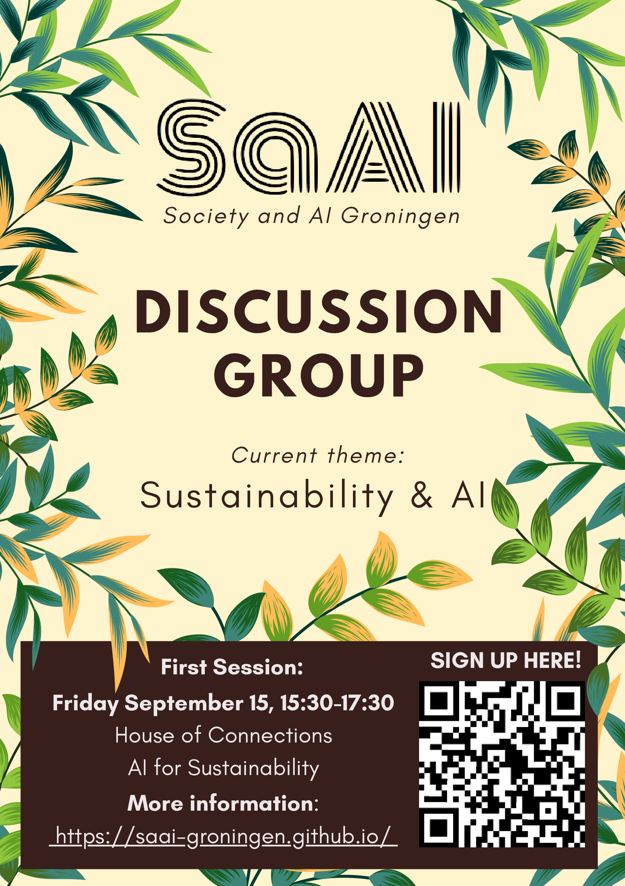

# Previous sessions

## 3rd session: January 29th, 2024
### _Are GPT-4 & friends too big? Reflecting on 3 years of “stochastic parrots”_

In this panel discussion event - open and accessible for everyone interested in AI
& Society, no technical background needed - we will discuss the legacy of a
[2021 paper](https://dl.acm.org/doi/10.1145/3442188.3445922) which was both influential and controversial (resulting in one of
the authors getting fired from Google!).

The term “stochastic parrot” has since become synonymous with the point of view
that large language models (including the current generation of ChatGPT/GPT-4,
Bard, Claude, LLAMA 2, and others) are inherently problematic: do they really “learn
something”, or do they seem to do so because of the complexity of the
statistical patterns they can recognize and reproduce?

In addition, these models are trained with large amounts of data, and a lot of computational
power is needed both for training and running these models: this causes
unsolvable problems such as environmental pollution (from energy use) and
social biases acquired from sets of training data that are too large to check
and curate the contents of.

The authors of the “stochastic parrots” paper have since become activists
arguing that for these reasons, the use of large language models should be
avoided or at least seriously limited. This stands in contrast to the view
that, while “stochastic parrots” raised important challenges, the benefits of
large language models still outweigh the downsides, and that the paper and its
authors both underestimate the impressiveness of current models and
overestimate their risks.

Now, several years after the publication of “stochastic parrots”, we take a
look at how both large language models themselves and the debates around them
have evolved in the last few years, in which AI and Natural Language Processing
have increasingly become hot topics, in science but also in politics and
society. Our panelists will defend a range of views that are more or less in
favour of “stochastic parrots” arguments, and with a background in different
fields: AI, computational linguistics, and (digital) humanities.

**The meeting will take place from 16:00-18:00 in room 5159.0062 (Zernike Campus, Energy Academy)**

## 2nd session: November 3rd, 2023

In the upcoming session, we'll take a deeper dive into the environmental costs of LLMs: we know they consume a lot of energy (and water), but how much exactly? And do you measure this, especially with the 'new generation' of models (ChatGPT and friends) that are surrounded by a cloud of secrecy about how they actually work? The session will be led by the SaAI group members with a background in NLP (Natural Language Processing); we'll look at how the debate inside the NLP community about environmental impacts of LLMs has developed in the last few years (looking particarly at [Strubell et al. 2019](https://aclanthology.org/P19-1355/) and [Luccioni &amp; Hernandez-Garcia 2023](https://arxiv.org/abs/2302.08476)) and contextualize it inside the wider debate about the environmental costs of AI. 

**The meeting will take place from 15:00-17:00 in room 1313.0125 (Collaboratorie A) in the Harmony Building (Oude Kijk in 't Jatstraat 26)**

**_If you'd like to attend, please sign up using the form linked above. (We'll have a bigger room than last time so there should be space for everyone). If you have any questions, you can reach out to us [via email](mailto:saai-groningen@rug.nl)._**

## Kick-off meeting: September 15th

Our first meeting will be on Friday, September 15th, 15:30-17:30 at the House of Connections (Grote Markt 21, Groningen).

Thank you for everyone who is interested in attending! Unfortunately the meeting is already fully booked. You can still register for the waiting list and/or being kept up to date for future meetings using [this form](https://gossminn.eu/saai/signup_230915.php). 
_(Please let us know ([via email](mailto:saai-groningen@rug.nl)) if you registered but can't make it, so that someone else can attend.)_
<!-- _(We have limited space, so please don't forget to register if you want to attend. Also, please let us know if you registered but can't make it, so that someone else can attend.)_ -->

### Abstract

> **Sustainability & AI and AI for sustainability: introduction and perspectives**

> Current discussions on sustainability in the context of Artificial Intelligence (AI) focus mainly on the energy consumption that models, such as neural networks, require to train and deploy: indeed, for large scale models, such as ChatGPT, the training time can amount to even months on clusters of specialized hardware—which is often also used for the deployment. This same hardware also poses sustainability issues, since its manufacturing requires a large amount of substances whose extraction or production can lead to serious cases of environmental or societal problems.

> Most of the AI community is aware of these problems and there is much active work, both on the hardware and software side, to increase sustainability of their practices. Techniques such as model compression can substantially reduce the memory requirements of the AI models, by trading off little to no performance. However, the effectiveness of these technologies is still up for debate.

> On the other hand, AI can also be used as a helpful tool in decreasing the environmental impact of existing technologies, e.g., by efficiently allocating resources in cyber-physical systems using reinforcement learning paradigms. Examples of machine learning in production are found in the food industry, where models are used to decrease crop irrigation water. Also, AI agents can optimize indoor vegetable and fish growth in greenhouses.

> In this first discussion, we are going to introduce the topic of sustainability and AI from the perspective of AI scientists currently working in the aforementioned fields. We will be introducing the main issues connected to sustainability in the field of AI and, more in general, computing, while presenting, in very broad terms, the technologies involved both in reducing the environmental impact of AI practices, and AI for sustainability.

### Discussion leaders

**Juan Diego Cardenas-Cartagena** is a lecturer in AI at the University of Groningen. He works in reinforcement learning and signal processing. And his research interests include data-driven control and estimation algorithms for building trustworthy AI agents in safety-critical systems.

**Marco Zullich** is a lecturer at the University of Groningen and one of the founders of the SaAI group. He completed his PhD in 2023 at the University of Trieste (Italy), with a thesis on neural network pruning and model compression. His research interests include model compression and trustworthy AI.
